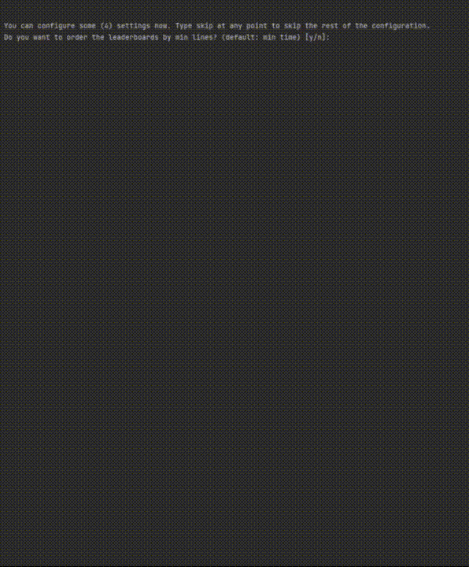

# BaS_GhostDL
Download the code of ghosts in the game 'Bots are stupid'.
<p align="center">
  
</p>

### How it works
This script checks your `%localappdata%/Temp/.net/BotsAreStupid` for the pre-installed levels. You can then select one of the levels which shows you a list of available ghosts for that level. Select one of them and you will see the code the player used to beat the level. 

**!!!Caution!!!**: The developer of the game could ban you from the leaderboards if you copy code from other players. Only use this program to collect inspiration from the fast and/or short codes users have submitted.

### Requirements
You need a [python3 installation](https://www.python.org/downloads/). You can install the used packages like this:
```sh
pip install prettytable
pip install requests
```

### Custom levels
Custom levels are not supported at the moment. However, you can find your downloaded custom levels in `%appdata%\BotsAreStupid\CustomLevels` and use the IDs of those levels to request the list of ghosts and download their code in the same way as for the custom levels. 

You can also find a [list of available levels](http://bas.leleg.de/game/Preview/Levels/List.php) online. `|` separates columns and `%` separates entries. The level content is base64-encoded.

### Releases
There is an executable file in the releases which got created with the following command:
```sh
pyinstaller main.py --onefile
```
However, I would recommend just installing python and running the script yourself. This file is only for those who do not want to install python.
You can find further information about pyinstaller and how it works [here](https://pyinstaller.org/en/stable/operating-mode.html).
